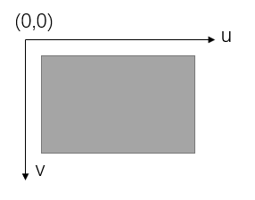
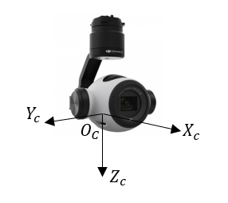
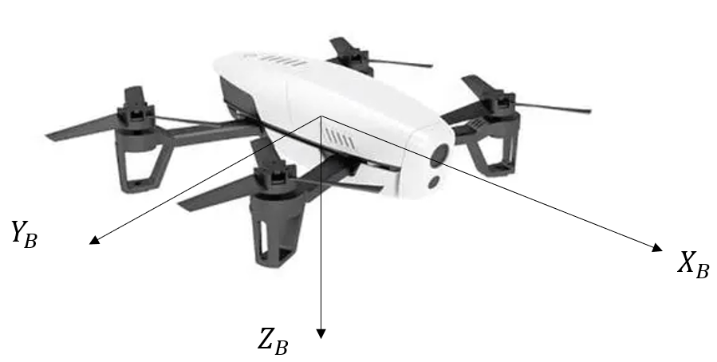

# 基于无人机吊舱单目相机的目标定位算法

本文讲解基于无人机吊舱图像的目标定位算法，吊舱相机为单目。假设大地为水平面。

## 代码

[github仓库代码](https://github.com/wujin-alex/drone-object-geolocation.git)

```shell
$ git clone https://github.com/wujin-alex/drone-object-geolocation.git
```

## 符号定义

激光测距为$L$

无人机高度$H$

相机坐标系到机体坐标系转移矩阵$R_C^B$

机体坐标系到大地坐标系转移矩阵$R_B^E$

## 坐标系定义

### 图像坐标系

该坐标系单位是像素。



### 归一化平面坐标系

该坐标系单位是m。


其中归一化平面坐标系的z默认为1，由于任何三维物体投影在一个平面上，深度信息都会消失，故使深度信息都为1m。

### 相机坐标系

该坐标系单位是m。

- 相机光轴朝前为z轴

- 相机右方为x轴

- 相机下方为y轴



### 机体坐标系

即无人机坐标系，该坐标系跟随无人机运动而运动，其中定义无人机质心为原点$O_B$，朝前为$X_B$，朝右为$Y_B$，垂直向下为$Z_B$，满足右手法则。

- x轴：朝前

- y轴：朝右

- z轴：朝下



### 站点坐标系

NED坐标系

- x轴：朝北
- y轴：朝东
- z轴：朝地

## 旋转矩阵

若已知无人机姿态角：$\phi,\theta,\Psi$，则机体坐标系到大地（站点）坐标系的旋转矩阵为$_{B}^{E}\textrm{R}$，即：
$$
_{B}^{E}\textrm{R}
=\begin{bmatrix}
cos\theta cos\Psi & sin\phi sin\theta cos\Psi-cos\phi sin\Psi & cos\phi sin\theta cos\Psi+sin\phi sin\Psi \\
cos\theta sin\Psi & sin\phi sin\theta sin\Psi+cos\phi cos\Psi & cos\phi sin\theta sin\Psi - sin\phi cos\Psi \\
-sin\theta & cos\phi sin\theta & cos\phi cos\theta
\end{bmatrix}
$$
同样，如果知道吊舱姿态角：$\phi,\theta,\Psi$，同样用上面相同的表达式可以得到相机坐标系到机体坐标系的旋转矩阵为：$_{C}^{B}\textrm{R}$，

则相机坐标系到站点坐标系的旋转矩阵为：
$$
_{C}^{E}\textrm{R}={_{B}^{E}\textrm{R}}  {_{C}^{B}\textrm{R}}
$$


## 相机投影公式

大地坐标系下有一点坐标为$P_e=[x_e, y_e, z_e]$，相机旋转矩阵为$R_E^C$，平移向量为$t_E^C$

1. 从大地坐标系到相机坐标系

$$
P_c=R_E^CP_e+t_E^C
$$

2. 从相机坐标系到归一化平面坐标系
   $$
   P_n=\frac{P_c}{z_c}\\
   \begin{pmatrix}
   x_n\\
   y_n\\
   1
   \end{pmatrix}=
   \begin{pmatrix}
   x_c/z_c\\
   y_c/z_c\\
   1
   \end{pmatrix}
   $$
   
3. 从归一化平面坐标系到像素坐标系
   $$
   P_{uv}=KP_n\\
   \begin{pmatrix}
   u\\
   v\\
   1
   \end{pmatrix}=
   \begin{bmatrix}
   f_x & 0 & c_x\\
   0 & f_y & c_y\\
   0 & 0 & 1
   \end{bmatrix}
   \begin{pmatrix}
   x_n\\
   y_n\\
   1
   \end{pmatrix}
   $$


## 无人机高度

如果没有激光测距，需要使用其他传感器获得无人机相对地面高度，如果有激光测距则可以通过激光测距计算无人机对地高度。

激光测量的距离为吊舱到光轴中心（图像中心）对应的实物之间的距离$L$。而有时候需要获得吊舱到目标的距离$D$，如果目标在图像中心点，则二者相等。

定义一个参考单位向量$P_{rg}=[0,0,1]$

激光测距点在相机坐标系下坐标$P_{0c}=[L,0,0]$，则在大地坐标系下坐标为$P_{0e}=R_C^EP_{0e}$，则相机光轴于垂直方向的夹角为：
$$
sin(\theta_1)=\frac{P_{0e}\times P_{rg}}{|P_{0e}|\cdot|P_{rg}|}
$$
则吊舱对地高度为：
$$
H=L*cos(\theta_1)
$$

## 定位公式推导

### 输入输出

吊舱参数K矩阵：

- 像素焦距$f_x$、$f_y$

  $f_x=f/\sigma_x$，即像素焦距（焦距对应多少各像素）

- $c_x$、$c_y$

输入：

- 目标所在图像的像素坐标$(u,v)$，
- 激光测距$L$，
- 无人机姿态角，
- 吊舱姿态角，
- 无人机GPS坐标。

### 目标向量

目标向量是指从吊舱到目标的向量。

### 推导过程

1. 归一化平面坐标系下目标归一化向量
   
   从像素坐标系到归一化平面坐标系
   $$
   P_n=K^{-1}P_{uv}
   $$
   分开写，就是：

$$
x_n=(u-c_x)/f_x \\
y_n=(v-c_y)/f_y
$$

2. 相机坐标系下目标归一化向量
   
   从归一化平面坐标系到相机坐标系，根据坐标系定义，有：
   $$
   P_c=\begin{bmatrix}
   0 & 0 & 1 \\
   -1 & 0 & 0\\
   0 & 1 & 0
   \end{bmatrix}P_n
   $$
   
   > 这个矩阵每一列表示归一化平面坐标系在相机坐标系下的投影。
   
2. 大地坐标系下目标归一化向量
   
   从相机坐标系到大地坐标系
   $$
   P_e=R_B^E R_C^B P_c
   $$
   
3. 吊舱到目标距离

   目标向量与垂直方向夹角$\theta_2$：
   $$
   sin(\theta_2)=\frac{P_eP_{rg}}{|P_{e}|\cdot|P_{rg}|}
   $$
   到目标的距离：
   $$
   D=H/cos(\theta_2)
   $$
   
4. 目标在相机坐标系下坐标
   $$
   P_c=P_c*D
   $$
   
4. 目标在机体坐标系下坐标
   $$
   P_b=R_C^B*P_c
   $$
   
4. 目标在站点坐标系下坐标
   $$
   P_e=R_B^E R_C^B P_c
   $$
   
8. 目标经纬度坐标

   1）由于站点WGS84坐标系（经纬高）$O_{lla}$已知，故可以得到在ECEF下的坐标$O_{ecef}$
   
   2）计算站点NED坐标系到ECEF坐标系的旋转矩阵$R_{ned}^{ecef}$，则目标在ECEF下的坐标为：
   $$
   P_{ecef}=R_{ned}^{ecef}P_e+O_{ecef}
   $$
   其中
   $$
   R_{ned}^{ecef}=
   \begin{bmatrix}
   -cos(lon)*sin(lat) & -sin(lon) & -cos(lon)*cos(lat)\\
   -sin(lon)*sin(lat) & cos(lon)  & -sin(lon)*cos(lat)\\
   cos(lat)           & 0         & -sin(lat)
   \end{bmatrix}
   $$
   
   
   3）根据目标的ECEF坐标便可以计算经纬度了

